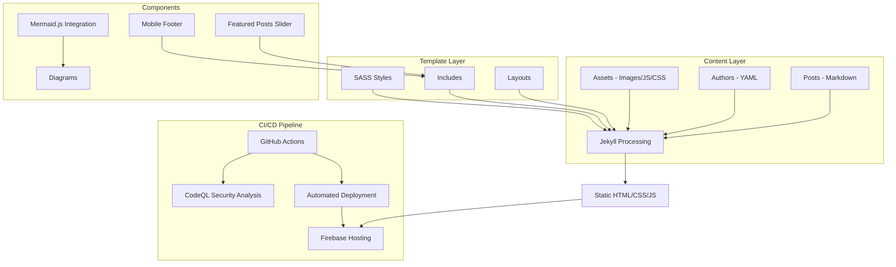
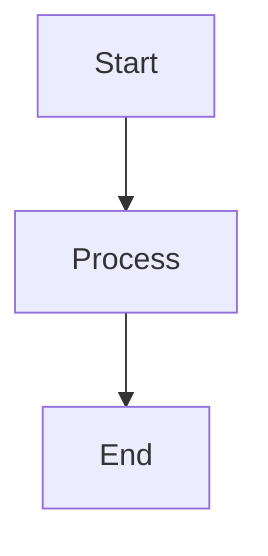
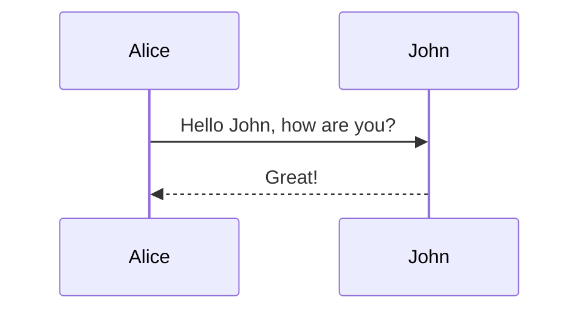

# Hugs4bugs


A modern, responsive tech blog built with Jekyll, featuring a sleek design with post slider, mobile-friendly interface, and built-in support for diagrams with mermaid.js.

## ✨ Features

- 📱 **Fully Responsive Design** - Works on all devices and screen sizes
- 🎚️ **Featured Posts Slider** - Showcase your best content
- 📊 **Built-in Diagram Support** - Create flowcharts and diagrams using mermaid.js
- 🔍 **SEO Optimized** - Get better search engine visibility
- 🚀 **Blazing Fast** - Static site with optimized assets
- 🌙 **Dark/Light Mode** - Support for both themes
- 💬 **Comments System** - Engage with your readers
- 🔄 **CI/CD Integration** - Automated builds and deployments

## 🏗️ Architecture

The project follows a straightforward architecture:
- **Jekyll**: Generates static site content from Markdown files
- **GitHub Actions**: Automates CI/CD pipeline, including CodeQL security analysis
- **Firebase**: Hosts the generated static site
- **Docker**: Provides containerized development and deployment environments



### 📁 Directory Structure

```
hugs4bugs/
├── _posts/           # Blog posts in Markdown format
├── _layouts/         # Page layout templates
├── _includes/        # Reusable components
├── _sass/            # SCSS stylesheets
├── assets/           # Static assets (JS, CSS, images)
├── _site/            # Generated site (not in repo)
├── Dockerfile        # Docker configuration
├── docker-compose.yml
├── Gemfile           # Ruby dependencies
└── _config.yml       # Site configuration
```

## 🚀 Getting Started

### Running Locally

1. Clone the repository:
   ```sh
   git clone https://github.com/sivolko/hugs4bugs.git
   cd hugs4bugs
   ```

2. Install dependencies and run the Jekyll server:
   ```sh
   gem install bundler && bundle install
   bundle exec jekyll serve
   ```

3. To load the server with live reloading:
   ```sh
   bundle exec jekyll serve -l
   ```

### 🐳 Run with Docker

1. Edit the `docker-compose.yml` file as per your preferences.

2. Start the server:
   ```sh
   docker-compose up
   ```

3. Stop the server:
   ```sh
   docker-compose stop
   ```

## 📝 Creating Content

### Blog Posts

Create a new Markdown file in the `_posts` directory with the following format:

```markdown
---
layout: post
title: "Your Post Title"
description: "A brief description of your post"
date: 2023-04-10 10:00:00
image: '/assets/img/posts/post-image.jpg'
category: 'technology'
tags:
  - web
  - development
  - tutorial
---

Your post content goes here. You can use **Markdown** formatting.

## Creating diagrams


```

### Diagrams with Mermaid.js

Create diagrams easily in your posts using mermaid syntax:

```markdown

```

## 🔄 Continuous Integration

The repository uses GitHub Actions to automate the CI/CD pipeline. The workflow includes:

1. **CodeQL Analysis**: Performs security analysis on the codebase to detect vulnerabilities
2. **Firebase Deployment**: Deploys the static site to Firebase Hosting

## 🤝 Contributing

Contributions are welcome! Feel free to raise PRs or issues if you find something useful or have suggestions for improvements.

1. Fork the project
2. Create your feature branch (`git checkout -b feature/amazing-feature`)
3. Commit your changes (`git commit -m 'Add some amazing feature'`)
4. Push to the branch (`git push origin feature/amazing-feature`)
5. Open a Pull Request

## 📄 License

This project is licensed under the MIT License - see the LICENSE file for details.

## 🙏 Acknowledgments

- Original theme based on [Hugs4Bugs](https://hugs4bugs.me)
- Built with [Jekyll](https://jekyllrb.com/)
- Diagram support via [Mermaid.js](https://mermaid-js.github.io/mermaid/#/)
