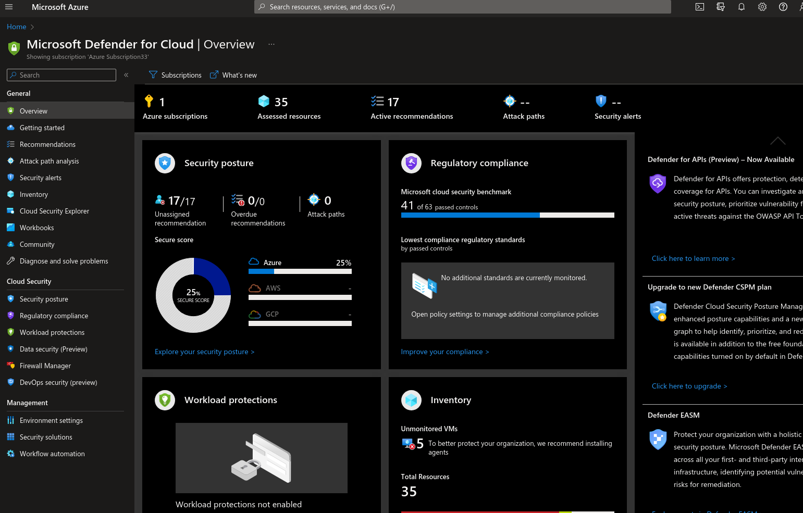

Let's understand what exactly MDC or Microsoft Defender for Cloud is?

## Microsoft Defender for Cloud is CNAPP tool.

CNAPP == Cloud Native Application Protection Platform

So, MDC is cloud native CNAPP tool with a set of security best practices and measures to protect cloud based APPs, Servers , API and resources.

It comes with the 3 loaded features 

- DevSecOps 
- CSPM 
- CWPP
It has 3 plans viz free one, Defender for servers P1 and P2

First let's understand the problem statement from different stakeholder's point of view,why do we need MDC?
<style type="text/css">
.tg  {border-collapse:collapse;border-spacing:0;}
.tg td{border-color:black;border-style:solid;border-width:1px;font-family:Arial, sans-serif;font-size:14px;
  overflow:hidden;padding:10px 5px;word-break:normal;}
.tg th{border-color:black;border-style:solid;border-width:1px;font-family:Arial, sans-serif;font-size:14px;
  font-weight:normal;overflow:hidden;padding:10px 5px;word-break:normal;}
.tg .tg-riw3{background-color:#ebf5ff;border-color:inherit;text-align:left;vertical-align:top}
.tg .tg-0pky{border-color:inherit;text-align:left;vertical-align:top}
@media screen and (max-width: 767px) {.tg {width: auto !important;}.tg col {width: auto !important;}.tg-wrap {overflow-x: auto;-webkit-overflow-scrolling: touch;}}</style>
<div class="tg-wrap"><table class="tg">
<thead>
  <tr>
    <th class="tg-riw3"><span style="font-weight:bold">Decision Makers</span></th>
    <th class="tg-0pky">CISO<br><br>CIO</th>
    <th class="tg-0pky">Operational Risk<br><br>How to reduce operational risk in cloud deployment?<br>How to meet regulatory compliant</th>
    <th class="tg-0pky"><span style="font-weight:bold">Comprehensive</span><br><br>Single Vendor approach and feature consolidation with predictable cost</th>
    <th class="tg-0pky"><span style="font-weight:bold">Compliance and Beyond MDC</span><br><br>Be compliant across estate and leverage existing investment.</th>
  </tr>
</thead>
<tbody>
  <tr>
    <td class="tg-0pky">Practitioners<br></td>
    <td class="tg-0pky">SOC Analyst <br><br>Security Engineer<br><br>Workload Owner</td>
    <td class="tg-0pky"><span style="font-weight:bold">Context, Control and Prevention</span><br><br>How to see context and determine security level?<br><br>Control over policy <br><br>Identify the right patch\action pre-deployment<br> </td>
    <td class="tg-0pky"><span style="font-weight:bold">Unified View , Coverage and Business Context</span><br><br>Unified views of all events from all sensors with description <br><br>Avoid agent complexity and be independent with 100% coverage <br><br>Calculate business risk and how it is linked with one's code?</td>
    <td class="tg-0pky"><span style="font-weight:bold">Pro-Active, Confidence in change with Native solution</span><br><br>Identification of what's broken? RED teaming approach <br><br>Change assignment <br><br>It should be native with streamline changes during code development with runtime failure.</td>
  </tr>
  <tr>
    <td class="tg-0pky"><span style="font-weight:bold;font-style:italic">Influencers</span><br></td>
    <td class="tg-0pky">Cloud Architect <br><br>DevSecOps</td>
    <td class="tg-0pky"><span style="font-weight:bold">Operational Risk, Controls</span><br><br>Security towards left approach <br><br>Operational risk assessment </td>
    <td class="tg-0pky"><span style="font-weight:bold">Comprehensive Coverage</span><br><br>Multi cloud support with one vendor with multi pipeline </td>
    <td class="tg-0pky"><span style="font-weight:bold">Control and Standards</span><br><br>Fit natively with existing blueprint, minimal changes needed with support of standard framework</td>
  </tr>
</tbody>
</table></div>

Now we do have understanding of requirements as per different stakeholder point of view, now let's understand the who exactly Security Engineers, Security Analyst, WOrkload Owner are? and what their responsiblity wrt MDC?

**Security Engineers** usually incharge of maintainig and updating tools and systems.

**Plan enablement**
- Enable specific Defender for Cloud plans
- Configure notification 
- Roles and Permissions 

**Alert tuning**
- Suppression Alerts
- Stream alerts to SIEM/ITSM (continuous export)

**Automation**
- Creation of new automation scenarios 
- Playbooks configuration and authentication 

**Agent and extension monitoring**
- Workbooks

**Security Analyst** aka first responder who reports on cybersecurity threats and implements any changes needed to protect the organisation. 

**Alert Investigation and Response**
- Assign owner,set due dates and optional settings 
- Configure notifications 

**Proactive detection /campaign detection**
- Inventory blade
- Cloud Security explorer/Attack path Analysis

**Action on regulatory compliance recommendation**
- Ensure technical controls align to specific standards
- Playbooks configuration

**Workload Owner** they are responsible for deploying workloads and remediating misconfigurations and vulnerabilities the security team discovers.

**Remediate misconfigurations**
- Assign owners, set due date and optional changes
- Configure notifications 

**Asset Inventory**
- Inventory blade

**Regulatory compliance** 
- Ensure technical controls align to specific standards
- Playbooks configuration and authentication 

**Data Visualisation**
- Workbooks

Now let's briefly understand the features of Microsoft Defender for cloud:-

* Easy onboarding of Multicloud like AWS, GCP account and native support for Azure.
* Bird Eye overview of security posture and vulnerabilities across clouds with secure scores
* Assess and implement best practices for compliance and security in the cloud.
* Protect Amazon EKS clusters and AWS EC2 workloads 
* Detect and block advanced malware and threats for linux and windows servers running in the cloud or on premises.

Highlevel Dashboard of Microsoft Defender for cloud 


We can strengthen multicloud security posture through Secure Score , Policy and Compliance and Automation .It leverage the Azure Arc with multicloud and hybrid workloads plans.It comes with full stack coverage with dedication detection which means we can easliy secure our compute, service layers, Databases and storage etc with MDC

(Img src: Microsoft)

**Multicloud Protection**


Let's understand what exactly Defender for Azure Service Layers does?

It helps to detect suspicious activities in Azure Management,Azure DNS and Azure Key Vault. This is agentless solution which means we just need to turn it ON.

* **Defender for Resource Manager**: Detects suspicious Azure Resource Management activities that indicate some workloads were potentially compromised.such as operations from Malicious IP address,disabling antimalware and suspicious scripts running in VM extensions.It can detects use of exploitation toolkits like Microburst or PowerZure.It can help in lateral movement detection.


* **Defender for DNS**: Detects suspicious Azure DNS communication that indicate some workloads were potentially compromised like 
- communication with suspicious domains C&C servers
- Bitcoin mining activities
- Phisihing activity
- Dark web
It also protects from sophisticated attacks through the DNS infra like DNS tunneling, exfiltrating data through DNS queries, Network intrusion signature, DNS cache poisoning.

* **Defender for Key Vault**: Detects suspicious or unusual Azure Key Vault activities that indicates some workloads certificates,Keys and Secrets were potentially compromised.It detects user accessed high volume of key vaults, Detect access from a TOR exit node to a kwy vaults, detects suspicious policy change and secret query in key vault.


## Microsoft Defender for Servers 
It is a complement EDR with incrased visibility,detection and prevention with following features:-

* Extend Visibility and Protection to on-premise and Multi-cloud Workloads
* Advanced protection and Detection Capabilites leveraging ML 
* Harden Machines against malware and comply with regulatory frameworks
* Mitigate network exposure of management ports.
* Integration with Microsoft Defender for Endpoint


We can turn on built-in vulnerability assessment for VMs with automated deployment of the vulnerability scanner.It continusously scans installed applications to find vulnerabilities for Linux and Windows VMs. It is powered by Qualys so gives us freedom to choose between Qualys and Microsoft threat and vulnerability management capabilities.


## How to on-board MDC to subscription?

Before jumping over the onboarding process, let's do a quick basic requirements setup in a place.

 1. Management group hierarchy definition in your Azure environment according to the organisation's needs.
 2. We have already decided on a log Analytics workspace design either centralized or distributed.

Considering above steps are configured, now there are 4 major steps for MDC on-boarding 

1. Enable Microsoft Deender for Cloud on a subscription
2. Make sure Azure Security Benchmark is assigned 
3. Enable Defender for cloud Plans 
4. Configure Auto-provisioning 

## How to register the resource provider?

```
{
    "type": Microsoft.Security/pricings",
    "apiVersion": "2018-06-01",
    "name": "VirtualMachines",
    "properties": {
        "pricingTier": "free"
    }
}

```

## How to enable Defender for Cloud plans at scale?

```
{
    "type": Microsoft.Security/pricings",
    "apiVersion": "2018-06-01",
    "name": "VirtualMachines",
    "properties": {
        "pricingTier": "Standard"
    }
}

```

and enable policy.


Thanks for reading blog, let's keep troubleshooting 

